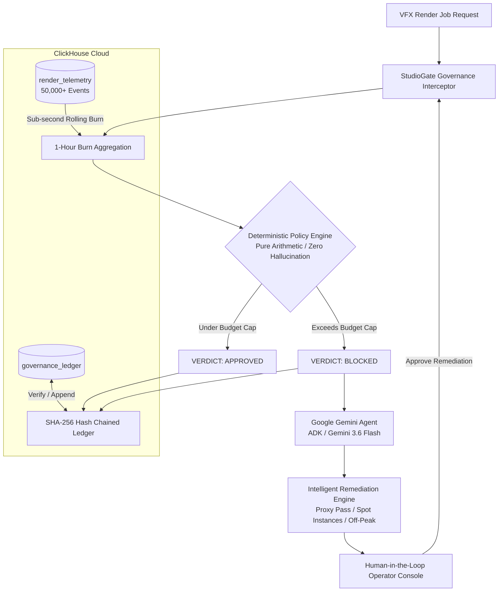

# 🎬 StudioGate

> **Autonomous Policy-Gated Governance Agent for Media & VFX Render Pipelines**  
> Built for **Agentic Cinema: The Blockbuster Hackathon** (*ClickHouse Partner Track*)

[](LICENSE)
[](https://www.python.org/)
[](https://clickhouse.com/)
[](https://ai.google.dev/)

---

## 📖 The Story

On a Friday evening, a VFX supervisor submits an 8K volumetric render batch and goes home for the weekend. By Monday morning, the job has run unchecked for 72 hours across 16 GPU nodes, and the project is $4,176 over budget with three weeks left to deliver.

StudioGate sits between the job dispatcher and the compute cluster. That batch never runs without a policy verdict. The supervisor still goes home on Friday.

---

## 📌 Executive Summary

Modern VFX, 3D rendering, NeRF reconstruction, and generative media pipelines can burn thousands of dollars an hour across distributed GPU nodes. Unchecked batch jobs and misconfigured autonomous agents risk blowing through monthly cloud budgets overnight.

**StudioGate** intercepts media production jobs in real time, evaluates them against live spend metrics with a **purely deterministic policy engine (0% LLM hallucination risk)**, logs decisions to an **immutable cryptographic hash-chained ledger** in **ClickHouse Cloud**, and uses **Google Gemini (ADK)** to synthesize actionable, compliant remediation proposals when jobs breach financial thresholds.

---

## 🏛️ System Architecture



---

## ⚡ Key Features

1. **Deterministic Policy Engine (`policy_engine.py`)**
   * Eliminates LLM math hallucinations from the decision loop.
   * Hard pass/fail decisions are made via pure Python arithmetic (`current_burn + job_cost <= cap`).
   * 100% test coverage with 27 unit tests validating boundary cases.
2. **ClickHouse Cloud High-Throughput Telemetry (`clickhouse_client.py`)**
   * Real-time aggregation of 50,000+ GPU telemetry records (`SUM(gpu_cost_per_sec * duration_sec)`).
   * Sub-second rolling 1-hour burn and node power metrics over MergeTree tables.
3. **Cryptographic Hash-Chained Audit Ledger (`hash_chain.py`)**
   * Tamper-evident ledger where every entry is chained with SHA-256:
     $$\text{entry\_hash} = \text{SHA-256}(\text{timestamp} + \text{canonical\_payload} + \text{prev\_hash})$$
   * Instant full-chain cryptographic audit verification.
4. **Google Gemini Intelligent Remediation (`remediation.py`, `agent.py`)**
   * When a job is blocked, Gemini 3.6 Flash analyzes constraints and synthesizes concrete studio alternatives (e.g. 4K proxy downscale, off-peak batching, spot instances).
5. **Mission Control Dashboard (`templates/index.html`)**
   * Live telemetry cards, interactive autonomous agent simulator, real-time ledger feed, and one-click cryptographic audit validation.

---

## 📊 Live Benchmark Results

Measured against **ClickHouse Cloud** (`europe-west4.gcp.clickhouse.cloud`) over 10 consecutive runs with Python `time.perf_counter()`:

| Operation | Min Latency | Median Latency | Max Latency | Target Dataset |
| :--- | :--- | :--- | :--- | :--- |
| **1-Hour Rolling Burn Aggregation** | **184.67 ms** | **207.25 ms** | 892.80 ms | 50,000 Telemetry Rows |
| **Full Ledger Chain Cryptographic Audit** | **172.14 ms** | **184.88 ms** | 252.20 ms | Historical Ledger Blocks |

*Full results logged in [`benchmark_results.json`](benchmark_results.json).*

---

## 🔍 Honesty Table

| What's Real | What's Simplified | What's Out of Scope |
| :--- | :--- | :--- |
| • **Deterministic policy engine** with 27 passing unit tests | • GPU telemetry is **synthetically seeded** via `seed_telemetry.py` — not streamed from a physical render farm | • Integration with legacy job dispatchers (Deadline, Tractor, AWS Batch) |
| • **SHA-256 hash-chain** with genesis block and tamper-evident verification | • Budget ceiling ($500) is a **demonstration threshold**, not a production-calibrated figure | • Multi-tenant studio isolation |
| • **Live ClickHouse Cloud queries** against real seeded telemetry (50,000 rows) | • Gemini remediation operates on **structured JSON context**, not raw cluster telemetry streams | • Production secrets management beyond `.env` |
| • **Real Gemini ADK tool calls** via `gemini-3.6-flash` | | |
| • **FastAPI backend** with live REST endpoints and Mission Control UI | | |

---

## 🚀 Quick Start

### 1. Prerequisites
* Python 3.12+
* ClickHouse Cloud instance (or local ClickHouse)
* Google Gemini API Key

### 2. Installation
```bash
# Clone the repository
git clone https://github.com/GreatSage-dev/studio-gate.git
cd studio-gate

# Create virtual environment
python -m venv .venv
source .venv/bin/activate   # On Windows: .venv\Scripts\activate

# Install dependencies
pip install -r requirements.txt
```

### 3. Environment Configuration
Copy `.env.example` to `.env` and fill in your credentials:
```env
CLICKHOUSE_HOST=your-instance.clickhouse.cloud
CLICKHOUSE_PORT=8443
CLICKHOUSE_USER=default
CLICKHOUSE_PASSWORD=your-clickhouse-password
CLICKHOUSE_DATABASE=default
CLICKHOUSE_SECURE=true
GOOGLE_API_KEY=your-gemini-api-key
HARD_BUDGET_CAP_USD=500.0
```

### 4. Seed Telemetry Data & Run Benchmarks
Generate 50,000 realistic telemetry records across GPU compute nodes:
```bash
python seed_telemetry.py
python benchmark.py
```

### 5. Launch the Mission Control Console
```bash
uvicorn app:app --reload --port 8000
```
Open `http://localhost:8000` in your browser.

---

## 🧪 Running Tests

Run unit and integration tests:
```bash
pytest -v
```

---

## 📄 License
This project is licensed under the MIT License - see the [LICENSE](LICENSE) file for details.
