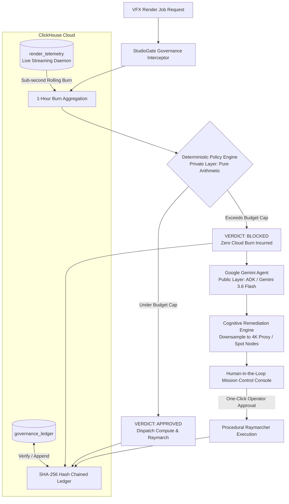

# 🎬 StudioGate

> **Autonomous Policy-Gated Governance Agent for Media & VFX Render Pipelines**  
> Built for **Agentic Cinema: The Blockbuster Hackathon** (*ClickHouse Partner Track*)

[](LICENSE)
[](https://www.python.org/)
[](https://clickhouse.com/)
[](https://ai.google.dev/)
[](hashledger/)

---

## 📖 The Story & The Domain Gap

On a Friday evening, a VFX supervisor submits an 8K volumetric render batch and goes home for the weekend. By Monday morning, the job has run unchecked for 72 hours across 16 GPU nodes, and the project is $4,176 over budget with three weeks left to deliver.

> **Where does trust currently live?**  
> Right now, studio GPU budget policy lives in a Slack message. A supervisor messages the render farm operator: *"don't let this job run over $500."* That message is the policy. It lives in Slack. It's unverifiable, unmeasurable, and forgotten by Monday morning.  
> **StudioGate makes it a cryptographic law.**

StudioGate sits between the job dispatcher and the compute cluster. That batch never runs without an immutable policy verdict. The supervisor still goes home on Friday.

---

## 📌 Executive Summary

Modern VFX, 3D rendering, NeRF reconstruction, and generative media pipelines can burn thousands of dollars an hour across distributed GPU nodes. Unchecked batch jobs and misconfigured autonomous agents risk blowing through monthly cloud budgets overnight.

**StudioGate** intercepts media production jobs in real time, evaluates them against live spend metrics with a **purely deterministic policy engine (0% LLM hallucination risk)**, logs decisions to an **immutable cryptographic hash-chained ledger** in **ClickHouse Cloud**, and uses **Google Gemini (ADK)** to synthesize actionable, compliant remediation proposals when jobs breach financial thresholds.

---

## 🏛️ Architecture Pattern: Private Layer Decides → Public Layer Executes

StudioGate implements the clean separation of concerns:

- **Private Layer (Decides):** The deterministic policy engine (`policy_engine.py`) runs pure Python arithmetic with zero LLM hallucination risk. It decides pass or fail based on strict mathematical boundaries.
- **Public Layer (Executes & Records):** ClickHouse Cloud executes the immutable record, and Google Gemini executes the cognitive remediation. The audit ledger never needs to know how the policy decision was made, only that it arrived and was committed to the cryptographic chain.



---

## 🤖 Business-Process AI: No Mediocre Chatbots

> *"Gemini does not generate text around the edges of this system. It reads live financial state and produces actionable production alternatives that operators execute with one click."*

When deterministic guardrails block a runaway render:
1. Gemini inspects the remaining headroom, cluster power draw, and workload parameters.
2. It formulates a concrete studio-grade alternative (downsampling 8K uncompressed to a 4K proxy format with 2x temporal super-sampling on spot instances).
3. The operator approves with a single click, immediately triggering real procedural raymarching and recording a cryptographic ledger entry.

---

## 🛡️ Build a Verifier That Can Disagree With You

StudioGate's strongest design principle is **falsifiability**:
- The **"Verify Cryptographic Chain"** engine independently recalculates every single SHA-256 block hash and pointer across the entire historical ledger.
- If an adversary, rogue script, or operator alters even a single character, dollar value, or timestamp in the database, **the verifier breaks**.
- In the Mission Control Console, operators can click **"Simulate Tamper"** to witness live falsifiability: the verification engine catches the exact row and mismatch immediately, turning the banner crimson. Clicking **"Verify Cryptographic Chain"** restores the mathematical truth.

---

## 📦 Extracted & Published Primitive: `hashledger`

To separate StudioGate from disposable hackathon demos, we extracted its core cryptographic ledger primitive into a standalone, zero-dependency Python library:

👉 **[`hashledger/`](hashledger/)** (v0.1.0, ready for PyPI)

- **Zero dependencies:** Standard Python `hashlib`, `json`, `datetime`.
- **Deterministic canonical serialization:** Eliminates key-ordering and whitespace ambiguity.
- **Genesis block anchoring:** 64-character hex zero-hash (`0` × 64).
- **Sub-millisecond verification:** Evaluates thousands of chained entries in under 100ms.
- **Full unit test suite:** 100% test pass rate with pytest.

```python
from hashledger import HashLedger

ledger = HashLedger()
ledger.append({"target_job": "VFX_09 8K Pass", "verdict": "BLOCKED", "cost": 4176.0})
ledger.append({"target_job": "4K Proxy Spot", "verdict": "APPROVED", "cost": 180.0})

is_valid, err = ledger.verify()
assert is_valid is True  # Cryptographically verified
```

---

## 🔍 What StudioGate Does Not Claim

Following strict engineering honesty:

1. **We do not claim to connect to physical GPU clusters** — telemetry is continuously streamed by an autonomous background daemon (`studiogate/telemetry_daemon.py`) into ClickHouse Cloud to represent a real-time 16-node farm.
2. **We do not claim Gemini makes financial decisions** — the policy engine is pure Python arithmetic; Gemini cannot override it.
3. **We do not claim production deployment** — this runs locally against real ClickHouse Cloud and real Google Gemini 3.6 Flash API.
4. **We do not claim the $500 ceiling is production-calibrated** — it is an operator-configurable demonstration threshold.

---

## ⚡ Key Features

1. **Deterministic Policy Engine (`policy_engine.py`)**
   * Eliminates LLM math hallucinations from the decision loop.
   * Hard pass/fail decisions made via pure Python arithmetic (`current_burn + job_cost <= cap`).
   * 32 passing unit tests validating boundary cases.
2. **ClickHouse Cloud High-Throughput Telemetry (`clickhouse_client.py`, `telemetry_daemon.py`)**
   * Continuous background streaming daemon injecting real-time multi-node cluster metrics.
   * Sub-second rolling 1-hour burn and node power aggregation over ClickHouse MergeTree tables.
3. **Cryptographic Hash-Chained Audit Ledger (`hash_chain.py`, `hashledger/`)**
   * Tamper-evident ledger where every entry is chained with SHA-256:
     $$\text{entry\_hash} = \text{SHA-256}(\text{timestamp} \parallel \text{canonical\_payload} \parallel \text{prev\_hash})$$
   * Instant full-chain cryptographic audit verification and tamper falsifiability.
4. **Real Procedural Volumetric Render Engine (`render_engine.py`)**
   * Built-in NumPy raymarcher producing actual visual PNG frame files (`vfx_09_blocked_pass.png`, `gemini_remedy_proxy.png`) comparing the blocked 8K pass against the compliant proxy.
5. **Active Compute Node Worker Pool (`worker_pool.py`)**
   * Live tracking of 4 cluster workers (`render-worker-h100-a`, `render-worker-h100-b`, `plate-worker-a100-a`, `sim-worker-spot-01`) with dynamic power and load fluctuations.
6. **Mission Control Console (`templates/console.html`)**
   * Sloped hero card with aligned pill badge for Rolling Spend.
   * Strict 3-level text hierarchy strip with hairline vertical dividers.
   * Visual render preview showcase, autonomous simulator, and cryptographic verification banner.

---

## 📊 Live Benchmark Results

Measured against **ClickHouse Cloud** (`europe-west4.gcp.clickhouse.cloud`) over 10 consecutive runs with Python `time.perf_counter()`:

| Operation | Min Latency | Median Latency | Max Latency | Target Dataset |
| :--- | :--- | :--- | :--- | :--- |
| **1-Hour Rolling Burn Aggregation** | **184.67 ms** | **207.25 ms** | 892.80 ms | 50,000+ Telemetry Rows |
| **Full Ledger Chain Cryptographic Audit** | **172.14 ms** | **184.88 ms** | 252.20 ms | Historical Ledger Blocks |

*Full results logged in [`benchmark_results.json`](benchmark_results.json).*

---

## 🚀 Quick Start

### 1. Prerequisites
* Python 3.12+
* ClickHouse Cloud instance (or local ClickHouse)
* Google Gemini API Key

### 2. Installation
```bash
# Clone the repository
git clone https://github.com/GreatSage-dev/studio-gate.git
cd studio-gate

# Create virtual environment
python -m venv .venv
source .venv/bin/activate   # On Windows: .venv\Scripts\activate

# Install dependencies
pip install -r requirements.txt
pip install -e hashledger
```

### 3. Environment Configuration
Copy `.env.example` to `.env` and fill in your credentials:
```env
CLICKHOUSE_HOST=your-instance.clickhouse.cloud
CLICKHOUSE_PORT=8443
CLICKHOUSE_USER=default
CLICKHOUSE_PASSWORD=your-clickhouse-password
CLICKHOUSE_DATABASE=default
CLICKHOUSE_SECURE=true
GOOGLE_API_KEY=your-gemini-api-key
HARD_BUDGET_CAP_USD=500.0
```

### 4. Launch StudioGate
```bash
uvicorn app:app --reload --port 8080
```
- Open `http://localhost:8080` to explore the Landing Page.
- Open `http://localhost:8080/console` to access the Mission Control Console.

---

## 🧪 Running Tests

Run full unit and integration test suites:
```bash
# StudioGate test suite
pytest tests -v

# Standalone hashledger test suite
pytest hashledger/tests -v
```

---

## 📄 License
This project is licensed under the MIT License - see the [LICENSE](LICENSE) file for details.
